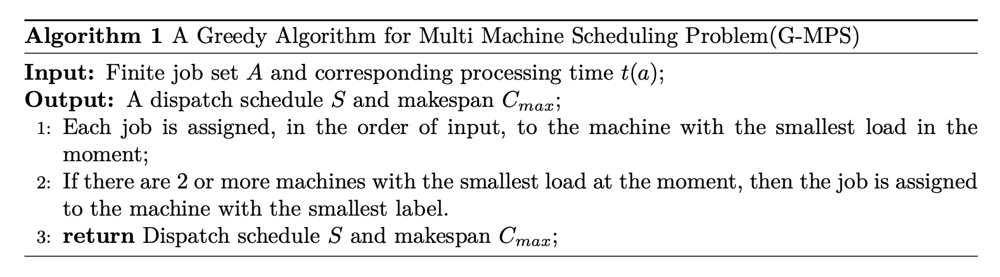
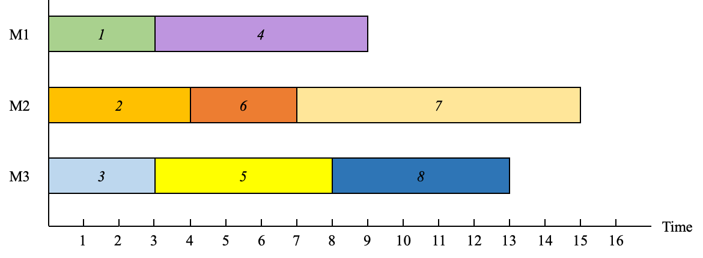
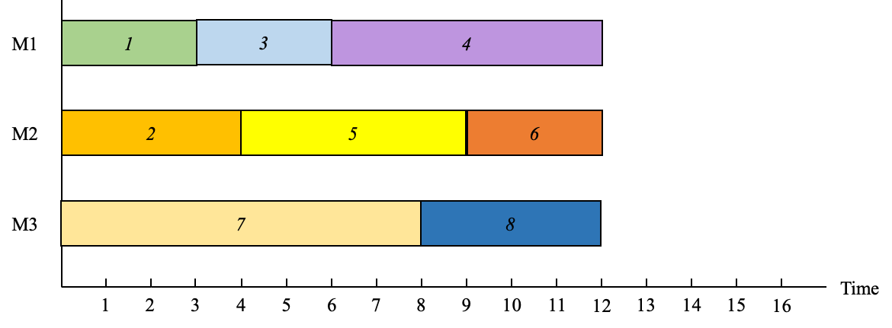
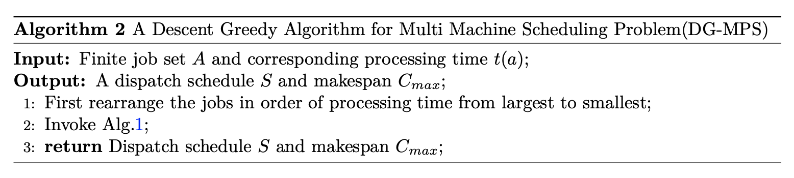

# Multi Machine Scheduling Problem

Finite job set $A$, $m$ identical machines and the processing time of job $a$ is a integer $t(a)$.

$$
\begin{equation}
\min \quad \max \left\{\sum_{a \in A_i} t(a) \ | \ i = 1, 2, ..., m\right\}
\end{equation}
$$

where $A_i$ is the job set of machine $i$. The following is a approximation algorithm,

The following shows a simple instance.

> **Instance 1**:  $3$ machines, $8$ jobs, processing time are $3, 4, 3, 6, 5, 3, 8, 4$.

For this instance, the output of *G-MPS* is,

And obiviously, the optimal solution of **Instance 1** is:

The output of *G-MPS* is 15 and optimal objective is 12. Thus, the error is 5/4. The following proof shows that for all instances, the error can be guaranteed by *G-MPS*.

> **Theorem 1**:  For all instance $I$ of multi machine scheduling problem with $m$ machines, 
> $$
> \begin{equation}
> 		G-MPS(I) \leq \left(2 - \frac{1}{m}\right) OPT(I)
> 	\end{equation}
> $$

> **Proof 1**:  There are two facts,
> $$
> \begin{equation}
> 		OPT(I) \geq \max_{a\in A} \ t(a)
> 	\end{equation}
> $$
>
> $$
> \begin{equation}
> 		OPT(I) \geq \frac{1}{m} \sum_{a \in A} \ t(a) \label{alg1:cond2}
> 	\end{equation}
> $$
>
> ​	Assume the machine with the biggest load is $M_j$, denote as $t(M_j)$. Assume $b$ is the last job assigned to machine $M_j$. So, clearly, when assigning job $b$, the load on $M_j$ is minimal, 
> $$
> 	\begin{align}
> 		t(M_j) - t(b) \leq \frac{1}{m} \left(\sum_{a \in A} t(a) - t(b)\right) \label{alg1:cond3}
> 	\end{align}
> $$
> ​	Then,
> $$
> \begin{align}
> 	G-MPS(I) = t(M_j)  & \leq \frac{1}{m}  \left(\sum_{a \in A} t(a) - t(b)\right) + t(b) \\
> 	& = \frac{1}{m} \sum_{a \in A} \ t(a) + \left(1 - \frac{1}{m}\right)t(b) \\
> 	& \leq OPT(I) + \left(1 - \frac{1}{m}\right)OPT(I) \\
> 	& = \left(2 - \frac{1}{m}\right) OPT(I)
> 	\end{align}
> $$
>
> ​	Therefore, *G-MPS*  is a *2-approximation*.

The above *G-MPS* can be improved. We can sort the processing time first. The pseudo code and the proof of approximation ratio has been shown below. 

> **Theorem 2**:  For all instance $I$ of multi machine scheduling problem with $m$ machines, 
> $$
> \begin{equation}
> 		DG-MPS(I) \leq \left(\frac{3}{2} - \frac{1}{2m}\right)OPT(I)
> 	\end{equation}
> $$

> **Proof 2**:  Assume the sorted jobs processing time is $a_1, a_2, ..., a_n$, the machine with biggest load is $M_j$ and the last job assigned to $M_j$ is job $a_i$. So, clearly,
>
> + If $M_j$ has only one job, then we obtain the optimal solution.
> + Otherwise, 
>
> $$
> \begin{align}
> 			&i \geq m+1 \\
> 			&OPT(I) \geq 2t(a_i) 
> \end{align}
> $$
>
> We have known the above two inequalities are constant set up, thus,
> $$
> \begin{align}
> 	DG-MPS(I) = t(M_j) & \leq \frac{1}{m} \left( \sum_{k=1}^nt(a_k) - t(a_i)\right)+ t(a_i) \\
> 	& = \frac{1}{m} \sum_{k=1}^n t(a_k) + \left(1 - \frac{1}{m}\right)t(a_i) \\
> 	& \leq OPT(I) + \left(1 - \frac{1}{m}\right) \cdot \frac{1}{2} OPT(I) \\
> 	& = \left(\frac{3}{2} - \frac{1}{2m}\right) OPT(I)
> \end{align}
> $$
>
> Therefore, *DG-MPS* is a *3/2-approximation*.

