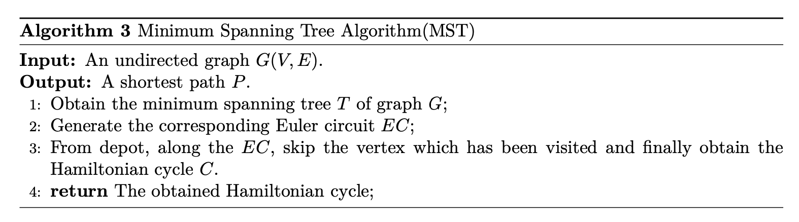

# Taveling Salesman Problem
Traveling Salesman Problem (TSP) can be described as finding a shortest path on an undirected graph $G(V, E)$. And each vertex should be visited exactly once. For general TSP, there is no constant approximation algorithm unless $P=NP$. 

> **Definition 1**:   **Metric TSP**. The Metric TSP is a subproblem of TSP, which has following features,
> $$
> \begin{align}
> 		& d(i, j) \geq 0 \\
> 		& d(i, j) = d(j, i) \\
> 		& d(i, j) + d(j, k) \geq d(i, k) 
> 	\end{align}
> $$

The following is a famous approximation algorithm of Metric TSP, which is a *2-approximation*.

> **Theorem 1**:  For all instance $I$ of Metric TSP, 
> $$
> \begin{equation}
> 		MST(I) \leq 2 OPT(I)
> 	\end{equation}
> $$

> **Proof 1**:  Denote the optimal Hamiltonian cycle $C$ as $c$ and the length as $l$. Delete one edge of $c$, then, 
> $$
> 	\begin{equation}
> 		l^\prime \leq l 
> 	\end{equation}
> $$
> As a matter of fact, we obtain a spanning tree $T^\prime$ of $G$. Obviously, the total weight of $T^\prime$ is larger than $T$,
> $$
> \begin{equation}
> 		W(T^\prime) \geq W(T) 
> 	\end{equation}
> $$
> Therefore,
> $$
> \begin{equation}
> l \geq l ^\prime = W(T^\prime) \geq W(T)		
> 	\end{equation}
> $$
> Therefore, the length or Euler circuit $l_e$,
> $$
> \begin{equation}
> 		l_e \leq 2OPT(I)
> 	\end{equation}
> $$
> Since,
> $$
> d(i, j) + d(j, k) \geq d(i, k) 
> $$
> Thus, traveling along the Euler circuit $EG$ from the depot and skiping the visited vertex, the routing distance $MST(I)$ must,
> $$
> 	\begin{equation}
> 		MST(I) \leq l_e \leq 2OPT(I)
> 	\end{equation} 
> $$
>
> Therefore, *MST* is a *2-approximation*. 

