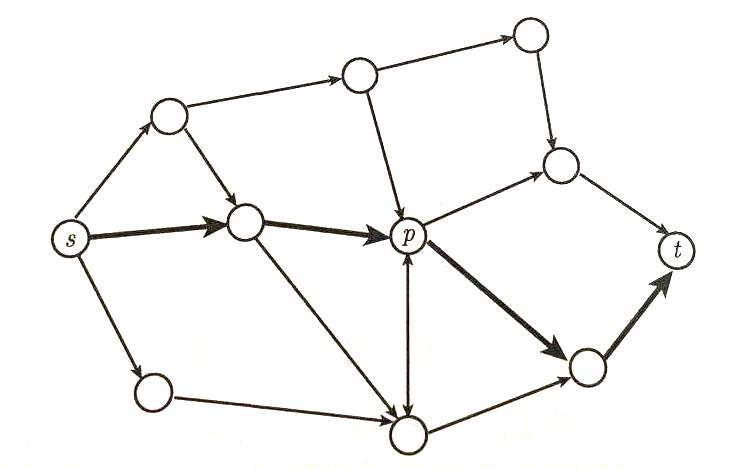

# Basic Dynamic Programming

## 1 Shortest Path Problem

Given a directed graph which has no negative weight arc, find the shortest path from $s$ to $t$. 




***Obsearvation***: *If the $s$-$t$ shortest path path passes by node $p$, then sub paths $(s,p)$ and $(p, t)$ are shortest path from $s$ to $p$ and from $p$ to $t$ respectively.*

So, we denote  $D_k(j)$ = the length of shortest path from $s$ to $j$, containing at most $k$ arcs, then the recursive equation is:
$$
D_k(j) = \min \left\{ D_{k-1}(j), \min_{i\in V\setminus \left\{j\right\}} \left\{D_{k-1}(i) + c_{ij}\right\}\right\}
$$
A simple demo written in C++ has been shown as below:

```c++
/**
 * Dijkstra's algorithm for shortest path problem.
 */
#include <iostream>
#include <vector>
#include <limits>
using namespace std;

class Solution {
public:
    /**
     * @param graph: graph stored in adjcent matrix
     * @param s: start node
     * @param e: end node
     * @return: The maximum size
     */
    int dijkstra(vector<vector<int>> graph, int s, int e) {
        int vertexNum = graph.size();
        vector<int> pre(vertexNum, 0);
        vector<bool> vis(vertexNum, 0);
        vector<int> dis(vertexNum, INT_MAX);

        // initialize distance
        for (int i = 0; i < vertexNum; ++i) {
            if (i == s) {
                dis[i] = 0;
            } else {
                dis[i] = graph[s][i];
            }
            if (graph[s][i] != -1) {
                pre[i] = s;
            } else {
                pre[i] = -1;
            }
        }
        vis[s] = true;
        // start for loop
        for (int i = 0; i < vertexNum; ++i) {
            int minimum = INT_MAX;
            int t;
            // find current shortest path
            for (int j = 0; j <vertexNum; ++j) {
                if (vis[j] == false && dis[j] < minimum) {
                    t = j;
                    minimum = dis[j];    
                }
            }
            vis[t] = true;
            for (int j = 0; j < vertexNum; ++j) {
                if (vis[j] == false && dis[j] > dis[t] + graph[t][j]) {
                    dis[j] = dis[t] + graph[t][j];
                    pre[j] = t;
                }
            }
        }
        return dis[e];
    }
};
```


## 2 0-1 Knapsack Problem

The 0-1 knapsack problem can be modeled as:
$$
f^* = \max \left\{\pmb{c}^T\pmb{x}\Big| \pmb{a}^T\pmb{x} \leq \pmb{b}, \pmb{x} \in \left\{0,1\right\}^n \right\}
$$
Define $1 \leq k \leq n$ as **stages**, $0 \leq \lambda \leq b$ as **states**. Then, the optimal value function:
$$
f_k(\lambda) = \max \left\{\sum_{j=1}^k c_jx_j \Big| \sum_{j=1}^k a_jx_j \leq \lambda, \pmb{x} \in \left\{0,1 \right\}^n\right\}
$$
And readily, $f^* =f_n(b)$. So, the recursive equation is:
$$
f_k(\lambda) = \max \left\{f_{k-1}(\lambda), c_k + f_{k-1}(\lambda-a_k)\right\}
$$
And initial conditions are
$$
\begin{align}
f_0(\lambda) = 0, f_1(\lambda) = \left\{ \begin{aligned}&0, && 0 \leq \lambda < a_1 \\ &\max\{c_1, 0\}, && \lambda \geq a_1 \end{aligned} \right.
\end{align}
$$
A simple demo written in C++ is shown as below:

```c++
/**
 * Dynamic Programming for 0-1 knapsack problem
 */
#include <iostream>
#include <vector>
using namespace std;

class Solution {
public:
    /**
     * @param m: An integer m denotes the size of a backpack
     * @param W: Given n items with size W[i]
     * @param V: Given n items with value V[i]
     * @return: The maximum size
     */
    int zeroOneKnapsack(int m, vector<int> W, vector<int> V) {
        vector<int> f(m + 1, 0);
        for (int i = 0; i < W.size(); i++) {
            for (int j = m; j >= W[i]; j--) {
                f[j] = max(f[j], f[j - W[i]] + V[i]);
            }
        }
        return f[m];
    }
};
```


## 3 Integer Knapsack Problem

The integer knaspack problem can be modeled as:
$$
f^* = \max \left\{\pmb{c}^T\pmb{x}\Big| \pmb{a}^T\pmb{x} \leq \pmb{b}, \pmb{x} \in \mathbb{Z}_+^n \right\}
$$
where $c_j > 0, a_j > 0, j = 1, ..., n$. The optimal optimal value function:
$$
g_r(\lambda) = \max \left\{\sum_{j=1}^k c_jx_j \Big| \sum_{j=1}^k a_jx_j \leq \lambda, \pmb{x} \in \mathbb{Z}_+^n\right\}
$$
And readily, $f^* = g_n(b)$. So, the recursive equation is:
$$
g_r(\lambda) = \max_{t = 0,1, ..., \lfloor \lambda / a_r\rfloor} \left\{c_rt + g_{r-1}(\lambda - a_rt\right\}
$$
However, in this way, the time compelxity could be $O(nb^2)$. Noticed that, 
$$
\begin{align}
&x_r^* = 0 \Rightarrow g_r(\lambda) = g_{r-1}(\lambda) \\
&x_r^* \geq 1 \Rightarrow x_r^* = 1 + t \Rightarrow g_r(\lambda) = g_r(\lambda - a_r) + c_r
\end{align}
$$
So, the better recursive equation is:
$$
g_r(\lambda) = \max \left\{g_{r-1}(\lambda),\ g_r(\lambda-a_r)+c_r\right\}
$$
And the time cpmlexity is $O(nb)$.

A simple demo written in C++ has been shown as below:

```c++
/**
 * Dynamic Programming for integer knapsack problem
 */
#include <iostream>
#include <vector>
using namespace std;

class Solution {
public:
    /**
     * @param m: An integer m denotes the size of a backpack
     * @param W: Given n items with size W[i]
     * @param V: Given n items with value V[i]
     * @return: The maximum size
     */
    int integerKnapsack(int m, vector<int> W, vector<int> V) {
        vector<int> f(m + 1, 0);
        for (int i = 0; i < W.size(); i++) {
            for (int j = W[i]; j <= m;j++) {
                f[j] = max(f[j], f[j - W[i]] + V[i]);
            }
        }
        return f[m];
    }
};
```


